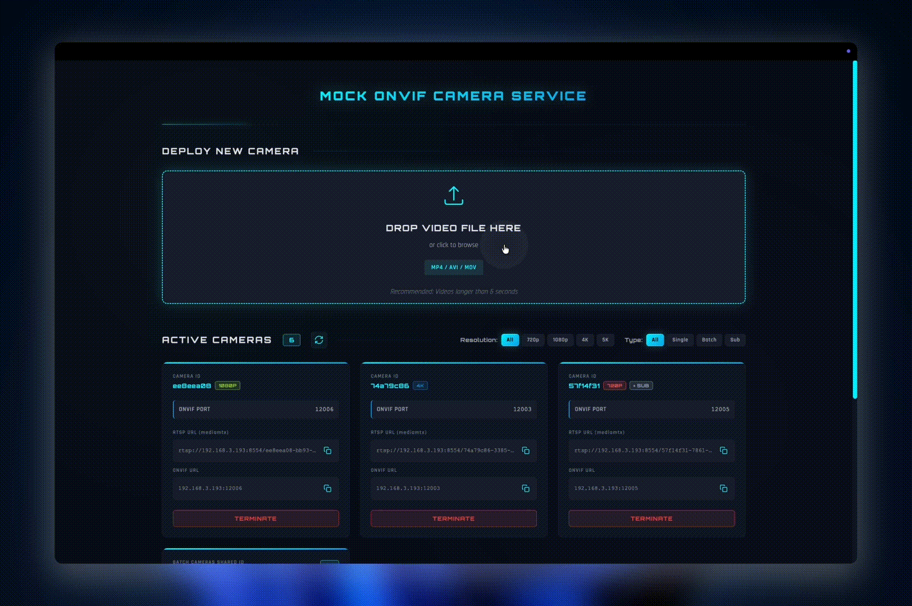

# Mock ONVIF Camera Service

An application that transforms video files into RTSP streams with ONVIF support, enabling seamless integration with NVR platforms.

 

## ✨ Key Features

- 📹 Convert video files into looping RTSP streams
- 🔌 Provide independent ONVIF Device/Media services for each camera
- 🌐 Web UI management interface
- 🔄 Automatic camera configuration save and restore
- 🚀 Support multiple cameras running simultaneously

---

## 🖥️ System Requirements

### Required Dependencies

#### 1. **Python 3.13** (recommended)

Python is required for running the service. 
After installing `uv`, you can use it to manage Python environments.

```bash
# Check if Python is available
python3 --version

# If Python is not installed:
# Ubuntu/Debian:
sudo apt update && sudo apt install -y python3 python3-pip

# macOS:
brew install python3
```

#### 2. **uv** (Python package/venv manager)
```bash
# Install uv
curl -LsSf https://astral.sh/uv/install.sh | sh

# Verify installation
uv --version
```

#### 3. **FFmpeg** (for video to RTSP streaming)
```bash
# Ubuntu/Debian
sudo apt update
sudo apt install ffmpeg

# macOS
brew install ffmpeg

# Verify installation
ffmpeg -version
```

#### 4. **mediamtx** (RTSP server)

> **Note**: Choose the appropriate version for your system from [mediamtx releases](https://github.com/bluenviron/mediamtx/releases/tag/v1.15.5)

```bash
# Download mediamtx (choose one based on your system)
# Linux AMD64:
wget -O mediamtx.tar.gz https://github.com/bluenviron/mediamtx/releases/download/v1.15.5/mediamtx_v1.15.5_linux_amd64.tar.gz

# macOS Apple Silicon (M1/M2/M3):
wget -O mediamtx.tar.gz https://github.com/bluenviron/mediamtx/releases/download/v1.15.5/mediamtx_v1.15.5_darwin_arm64.tar.gz

# macOS Intel:
wget -O mediamtx.tar.gz https://github.com/bluenviron/mediamtx/releases/download/v1.15.5/mediamtx_v1.15.5_darwin_amd64.tar.gz

# Extract and install
tar -xzf mediamtx.tar.gz
sudo mv mediamtx /usr/local/bin/
sudo chmod +x /usr/local/bin/mediamtx
rm mediamtx.tar.gz

# Verify installation
mediamtx --version
```

---

## 📦 Installation & Deployment & Start Service

### ⚙️ Configuration (Optional)

Create `.env` file from `.env.example` to customize server settings:

```bash
cp .env.example .env
```

Edit `.env` to configure (`app/config.py` is the single source of truth for defaults):

**Server**

| Variable | Default | Description |
|---|---|---|
| `SERVER_HOST` | `0.0.0.0` | Flask bind host |
| `SERVER_PORT` | `9999` | Web UI / REST port |
| `DEBUG_MODE` | `false` | Flask debug mode |
| `EXTERNAL_IP` | *(auto-detect)* | Host IP advertised to NVRs in RTSP/ONVIF URLs (Docker only; see Method 2) |

**MediaMTX**

| Variable | Default | Description |
|---|---|---|
| `MEDIAMTX_HOST` | `127.0.0.1` | RTSP server host FFmpeg pushes to (`mediamtx` in Docker) |
| `MEDIAMTX_PORT` | `8554` | RTSP server port |

**Upload & disk limits**

| Variable | Default | Description |
|---|---|---|
| `MAX_UPLOAD_MB` | `500` | Largest single upload (HTTP 413 if exceeded) |
| `MAX_VIDEO_SIZE_MB` | `1024` | Largest transcoded output; transcode aborted and file deleted if exceeded |
| `DATA_CLEANUP_ENABLED` | `true` | Orphan scanner for `data/videos` & `data/snapshots` |
| `DATA_CLEANUP_INTERVAL_HOURS` | `1` | Orphan scan interval |
| `DATA_ORPHAN_GRACE_SECONDS` | `300` | Skip files newer than this (could be a transcode in flight) |
| `LOG_CLEANUP_INTERVAL_HOURS` | `24` | Disk-side sweep interval for `./logs` (deletes logs older than 3 days) |

**Reliability**

| Variable | Default | Description |
|---|---|---|
| `WATCHDOG_ENABLED` | `true` | Auto-restart dead FFmpeg / ONVIF subprocesses |
| `WATCHDOG_INTERVAL_SECONDS` | `15` | Liveness check interval |
| `WATCHDOG_MAX_RESTARTS` | `5` | Park a camera after N consecutive restart attempts (failed attempts count too) |
| `WATCHDOG_RESTART_COOLDOWN_SECONDS` | `300` | Failure counter resets after the camera runs this long without another restart |
| `PROCESS_KILL_GRACE_SECONDS` | `0.5` | Grace between SIGTERM and SIGKILL when stopping subprocesses |

**Concurrency**

| Variable | Default | Description |
|---|---|---|
| `BATCH_MAX_WORKERS` | `20` | Thread pool size for batch (multi-camera) creation |

**ONVIF**

| Variable | Default | Description |
|---|---|---|
| `ONVIF_PORT_MIN` | `12000` | Lower bound of the per-camera ONVIF port range |
| `ONVIF_PORT_MAX` | `13000` | Upper bound of the per-camera ONVIF port range |
| `ONVIF_USERNAME` | `test` | Credentials shown in the Web UI for the NVR (mock cameras accept anything) |
| `ONVIF_PASSWORD` | `pass` | See above |
| `ONVIF_DISPATCHER_ENABLED` | `false` | Collapse N `onvif_server.py` subprocesses into a single in-process Flask + werkzeug-per-port server. Saves ~25 MB RSS per camera. Opt-in |

**Macvlan** (per-camera IP mode; see Method 1)

| Variable | Default | Description |
|---|---|---|
| `MACVLAN_ENABLED` | `false` | Give each camera its own IP + MAC on the LAN |
| `MACVLAN_DHCP` | `false` | Let the router assign camera IPs via DHCP |
| `MACVLAN_SUBNET` | `192.168.0.0/24` | Static pool subnet (when DHCP off) |
| `MACVLAN_GATEWAY` | `192.168.0.1` | Static pool gateway |
| `MACVLAN_IP_START` | `192.168.0.201` | Static pool first IP |
| `MACVLAN_IP_END` | `192.168.0.250` | Static pool last IP |
| `MACVLAN_PARENT_IFACE` | `eth1` | NIC name *inside* the container. Not auto-detected when omitted — auto-detection only runs as a fallback if the configured/default name doesn't exist |
| `MACVLAN_PARENT` | `eth0` | *Compose-only* — host NIC used as parent of the Docker macvlan network (`docker-compose.macvlan.yml`); not read by the app |

**Note**: For Docker deployment, you can also set these via environment variables in `docker-compose.yml` or pass them when running `docker compose up`.

### 🐳 Method 1: Docker with Macvlan (Per-Camera IP)

> **Each camera gets its own IP and MAC address on the LAN**, allowing NVR platforms like UniFi Protect to discover them as independent devices — no port mapping needed, ONVIF runs on standard port 80.

#### Prerequisites

- **Linux host only** — not supported on macOS Docker Desktop
- Host must be on the same LAN subnet as the target NVR
- Docker with `NET_ADMIN` capability support

#### Step 1: Configure ARP Isolation (run once on the host)

Without this, the host NIC answers ARP for all macvlan IPs, causing every camera to resolve to the same MAC address.

```bash
sudo bash scripts/setup-macvlan-host.sh eth0
```

To make persistent across reboots, add to `/etc/sysctl.conf`:
```
net.ipv4.conf.eth0.arp_ignore=1
net.ipv4.conf.all.arp_ignore=1
net.ipv4.conf.eth0.arp_announce=2
net.ipv4.conf.all.arp_announce=2
```

#### Step 2: Create `.env` file

```bash
cp .env.example .env
```

Edit `.env` with your network settings:

```env
# Required
MACVLAN_ENABLED=true
MACVLAN_PARENT=eth0            # Host physical NIC

# IP assignment — choose one:

# Option A (recommended): DHCP — router assigns IPs automatically
MACVLAN_DHCP=true

# Option B: Static IP pool (ensure range doesn't overlap router DHCP)
# MACVLAN_DHCP=false
# MACVLAN_SUBNET=192.168.0.0/24
# MACVLAN_GATEWAY=192.168.0.1
# MACVLAN_IP_START=192.168.0.201
# MACVLAN_IP_END=192.168.0.250
```

> **Note:** `MACVLAN_PARENT` is the *host* NIC and is only used by `docker-compose.macvlan.yml` to build the Docker macvlan network. `MACVLAN_PARENT_IFACE` is the NIC name *inside* the container and defaults to `eth1` (which is what Docker names the macvlan-attached interface). It is not auto-detected when omitted — auto-detection only runs as a fallback if the configured/default interface doesn't exist in the container.

#### Step 3: Start with macvlan overlay

```bash
docker compose -f docker-compose.yml -f docker-compose.macvlan.yml up -d
```

#### How it works

```
Host LAN (192.168.0.0/24)
├── Router/Gateway (192.168.0.1)
├── Host (192.168.0.100)
├── Camera 1 — cam_aabbccdd (192.168.0.201) ← own MAC, ONVIF on :80
├── Camera 2 — cam_eeff0011 (192.168.0.202) ← own MAC, ONVIF on :80
└── NVR
```

- Each camera creates a macvlan sub-interface (`cam_<id>`) with a unique MAC
- ONVIF server binds to that IP on port 80 (standard ONVIF port)
- FFmpeg still streams to shared mediamtx via the bridge network
- NVR discovers each camera as a separate device on the LAN

#### Limitations

- **Linux only**: macvlan requires a real Linux kernel. Does not work on macOS Docker Desktop or Windows WSL2
- **Same L2 network**: The host and NVR must be on the same physical network segment (same switch/subnet). Cloud VMs and Kubernetes do not support macvlan (MAC spoofing is blocked)
- **Host cannot reach macvlan IPs**: By design, the Docker host cannot directly access macvlan container IPs. Use the Web UI (port 9999) to manage cameras
- **DHCP lease time**: In DHCP mode, the router assigns IPs. If the container restarts, cameras may receive different IPs (unless the router has static DHCP leases by MAC)
- **ARP isolation required**: Without `arp_ignore=1` + `arp_announce=2` on the host, all cameras will appear with the same MAC to the NVR

### 🐳 Method 2: Docker Deployment

```bash
# 1. Enter project directory
cd mock-onvif-camera

# 2. Start all services with one command
docker compose up -d

# 3. Open Web UI
open http://localhost:9999
```

**⚠️ Important Note about Docker Networking (or Port Forwarding Environment):**

Due to Docker's bridge network, the service will use the container's internal IP (172.x.x.x) by default. This causes two critical issues:

1. **Web UI Display**: The camera cards in the Web UI will show RTSP and ONVIF URLs with the container's internal IP (e.g., `rtsp://172.19.0.3:8554/camera-id`), which is not accessible from outside the Docker network.

2. **ONVIF Service Configuration**: When NVR platforms (like UniFi Protect) query the ONVIF server, they receive URLs containing the container's internal IP. This prevents the NVR from accessing the camera streams because it cannot reach the container's internal network.

**Solution**: Set the `EXTERNAL_IP` environment variable to your **host machine's IP address**. This ensures:

- ✅ Web UI displays correct, accessible RTSP and ONVIF URLs
- ✅ ONVIF server tells NVR platforms the correct IP address for stream access
- ✅ Cameras can be properly discovered and accessed by external devices

```bash
# Find your host IP first
ifconfig | grep "inet " | grep -v 127.0.0.1

# Start with your host IP (example: 192.168.1.100)
EXTERNAL_IP=192.168.1.100 docker compose up -d
```

**Example**: With `EXTERNAL_IP=192.168.1.100`, the Web UI and ONVIF service will show:
- RTSP URL: `rtsp://192.168.1.100:8554/camera-id`
- ONVIF URL: `192.168.1.100:12000`

Instead of the inaccessible container IP (e.g., `rtsp://172.19.0.3:8554/camera-id`).

### Method 3: Automated Local Deployment

```bash
# 1. Enter project directory
cd mock-onvif-camera

# 2. Run automated deployment script
./setup.sh

# 3. (Optional) Create .env file to customize settings
cp .env.example .env
# Edit .env if needed

# 4. One-click startup (automatically starts mediamtx and main service)
./start.sh
```

---

## 📝 Usage

### Create New Camera

1. Click "UPLOAD VIDEO" in Web UI
2. Select video file and configure settings:
    - **Camera Count**: 
      - `Single Camera`: Create one camera instance
      - `Multiple Cameras`: Create multiple cameras sharing the same video (batch mode)
    - **Quality Settings**:
      - Choose resolution: `480p`, `720p`, `1080p`, `4K`, `5K`
      - Or use `Custom` to set resolution, FPS, and bitrate manually
    - **Enable Sub Profile**: Optional secondary 360p stream for single cameras
      - Main profile uses your selected quality
      - Sub profile fixed at `360p` / 24 fps / 750 kbps (accessible via ONVIF `Profile_2`, advertised as `SubProfile_360p`)
3. System will automatically:
    - Start FFmpeg process to push video to RTSP
    - Start independent ONVIF server instance
    - Assign unique port and ID

### View Camera Information

Each camera displays:
- **Camera ID**: Unique identifier
- **RTSP URL**: `rtsp://host-ip:8554/[camera-id]`
- **ONVIF URL** (standard mode): `host-ip:12000` — each camera has its own port (12000, 12001, ...)
- **ONVIF URL** (macvlan mode): `camera-ip:80` — each camera has its own IP, ONVIF on standard port 80
- **Camera IP** (macvlan mode only): the IP assigned to this camera on the LAN

### Add to NVR platform

Taking UniFi Protect (6.2.88) as an example:
1. Go to Devices page
2. Click `?` icon, then click `try advanced adoption` (Or use AI Port)
3. Enter:
   - **Standard mode** — IP Address: `host-ip:onvif-port` (e.g., `192.168.0.87:12000`)
   - **Macvlan mode** — IP Address: `camera-ip` (e.g., `192.168.0.201`) — port 80 is implicit
   - **Username**: Any Username (e.g., `test`)
   - **Password**: Any password (e.g., `pass`)
4. Click `Confirm`
5. Wait 10-30 seconds for camera to come online

### Delete Camera

Click the `TERMINATE` button on camera card, will automatically:
- Stop FFmpeg process
- Stop ONVIF server
- Delete video and configuration files

---

## 🏗️ System Architecture

```
Video File Upload
   ↓
Pre-transcoding (H.264/AAC optimization)
   ↓
Snapshot Generation (thumbnail filter, 100 frames analysis)
   ↓
FFmpeg (stream copy, push to mediamtx)
   ↓
mediamtx:8554 (RTSP server)
   ↓
UniFi Protect (pull stream directly)
   ↑
ONVIF Server:80 / 12000+ (provide device info and stream URL)
```

### Process Flow

1. **Video Upload**: User uploads video file via Web UI
2. **Pre-transcoding**: FFmpeg transcodes video to optimized H.264/AAC format for efficient streaming
3. **Snapshot Generation**: FFmpeg analyzes first 100 frames (after skipping 2 seconds) using thumbnail filter to select the best representative frame
4. **FFmpeg Streaming**: Reads transcoded video, uses stream copy mode (no re-encoding), loops playback, pushes RTSP stream to mediamtx
5. **mediamtx**: Receives FFmpeg's stream, serves as RTSP server externally
6. **ONVIF Server**: Provides ONVIF Device/Media services, tells UniFi Protect where the RTSP URL is
7. **UniFi Protect**: Queries RTSP URL via ONVIF, then pulls video stream directly from mediamtx

---

## 🔍 Verifying Streaming

### Test RTSP Stream
```bash
# After creating camera, test RTSP stream
ffprobe rtsp://localhost:8554/[camera-id]

# Or play with VLC
vlc rtsp://localhost:8554/[camera-id]
```

### Test ONVIF Service
```bash
# ONVIF GetSystemDateAndTime (no auth required per ONVIF spec)
curl -X POST http://localhost:12000/onvif/device_service \
  -H "Content-Type: application/soap+xml; charset=utf-8" \
  -d '<?xml version="1.0" encoding="UTF-8"?>
<soap:Envelope xmlns:soap="http://www.w3.org/2003/05/soap-envelope"
               xmlns:tds="http://www.onvif.org/ver10/device/wsdl">
  <soap:Body>
    <tds:GetSystemDateAndTime/>
  </soap:Body>
</soap:Envelope>'

# ONVIF GetDeviceInformation (requires auth)
curl -u test:pass -X POST http://localhost:12000/onvif/device_service \
  -H "Content-Type: application/soap+xml" \
  -d '<?xml version="1.0" encoding="UTF-8"?>
<soap:Envelope xmlns:soap="http://www.w3.org/2003/05/soap-envelope"
               xmlns:tds="http://www.onvif.org/ver10/device/wsdl">
  <soap:Body>
    <tds:GetDeviceInformation/>
  </soap:Body>
</soap:Envelope>'
```

### List All Mock Cameras
```bash
curl -s http://localhost:9999/cameras | jq
```

---

## 🌐 REST API

All endpoints are served on `SERVER_PORT` (default `9999`).

| Method | Path | Request | Response (success) |
|---|---|---|---|
| `GET` | `/` | — | Web UI (`index.html`) |
| `POST` | `/upload` | `multipart/form-data` — `file` (required); optional: `camera_count`, `sub_profile`, `camera_name`, `width`, `height`, `fps`, `video_bitrate`, `audio_bitrate`, `trim_start`, `trim_end`, `speed`, `extend_last_frame` | `201` `{"cameras": [<camera>, ...], "count": n}` — always this shape, even for a single camera |
| `GET` | `/cameras` | — | `200` `{"cameras": [<camera>, ...]}` |
| `GET` | `/cameras/<id>` | — | `200` `<camera>` |
| `DELETE` | `/cameras/<id>` | — | `200` `{"status": "deleted", "id": "<id>"}` |
| `GET` | `/snapshots/<filename>` | — | `200` JPEG thumbnail (e.g. `/snapshots/<camera-id>.jpg`) |
| `GET` | `/config` | — | `200` `{"param_ranges", "valid_audio_bitrates", "edit_limits", "extend_frame_duration"}` — validation ranges the Web UI uses |
| `GET` | `/health` | — | `200` `{"status": "ok", "cameras": n}` |

**Camera object** (`<camera>`): `id`, `video_path`, `rtsp_port`, `onvif_port`, `ffmpeg_pid`, `onvif_pid` (`null` in dispatcher mode — no subprocess), `rtsp_url`, `onvif_url`, `snapshot_url`, `username`, `password`, `width`, `height`, `fps`, `video_bitrate_mbps`, `sub_profile`, `manufacturer`, `created_at`; plus `shared_video_id` (batch-created cameras), `camera_ip` (macvlan mode), `ffmpeg_pid_sub` / `rtsp_url_sub` (when sub profile enabled).

**Error envelope**: every error returns JSON `{"error": "<message>", "type": "<ExceptionName>"}` with the matching HTTP status — including `404` (`NotFound`, also for unknown camera IDs as `CameraNotFoundError`), `405` (`MethodNotAllowed`) and `500` (`InternalError`). Two variations: request-schema violations return `400` `{"error": "validation failed", "details": [...]}`, and oversized uploads return `413` `{"error": "upload exceeds limit (... MB)"}`.

**Notes**
- `camera_name` feeds the ONVIF `Manufacturer` field; it is whitelist-validated (letters, digits, spaces, `_`, `-`, `.`; 1–50 chars).
- There is no `/data/...` route — videos and the SQLite database are not downloadable; only `/snapshots/<filename>` is exposed.

---

## 🛡️ Reliability & Disk Retention

Four layers of bounds keep the service from filling the disk or leaving zombies behind.

### Log retention

| Layer | Location | Cap | Worst-case footprint |
|---|---|---|---|
| Docker daemon stdout | host `/var/lib/docker/.../*-json.log` | `json-file` driver, `max-size 50m`, `max-file 5` | ≤ 250 MB per container |
| App FFmpeg log | `./logs/ffmpeg/ffmpeg_<id>.log` | `RotatingFileHandler` 3 MB × 4 | 12 MB per camera |
| App ONVIF log | `./logs/onvif/onvif_<id>.log` | same as above | 12 MB per camera |
| Disk-side sweep | `./logs/**` | 24-hour scan, delete files older than 3 days | — (belt + braces) |

> **Production tip:** also set Docker daemon defaults in `/etc/docker/daemon.json` so any future container inherits the cap:
> ```json
> {"log-driver":"json-file","log-opts":{"max-size":"50m","max-file":"5"}}
> ```

### Video / snapshot retention

- **Per-file size cap**: `MAX_VIDEO_SIZE_MB` (default `1024`). Transcoded outputs over the cap are deleted and the upload is rejected.
- **Orphan scanner** (`app/data_cleaner.py`): every hour (and once at boot) it sweeps `data/videos/*.mp4` and `data/snapshots/*.jpg`. Anything not referenced by a row in `service.db` and older than `DATA_ORPHAN_GRACE_SECONDS` (default 5 min) is removed.
- **Upload cap**: Flask `MAX_CONTENT_LENGTH` set from `MAX_UPLOAD_MB` (default `500`).

### Process supervision

- **Watchdog** (`app/watchdog.py`) checks every `WATCHDOG_INTERVAL_SECONDS` (default 15) whether each camera's FFmpeg + ONVIF subprocesses are still alive. Dead ones are respawned. A camera is parked after `WATCHDOG_MAX_RESTARTS` consecutive failures and logged loudly.
- **Zombie reaping**: every FFmpeg / ONVIF subprocess teardown calls `waitpid` so long-running create/delete cycles don't accumulate defunct PIDs.
- **Logger FD release**: per-camera rotating log handlers are explicitly closed on `delete_camera`, preventing the file-descriptor leak that long-lived deployments would otherwise suffer.

### Persistence

Camera metadata lives in **SQLite** (`data/service.db`). On startup, any legacy `data/cameras/*.yaml` is migrated automatically (idempotent — re-running is safe). The schema is created on first boot; no manual setup needed.

---

## 🛠️ Performance Optimization

### Two-Stage Processing

The system uses a two-stage approach to minimize CPU usage during streaming:

#### Stage 1: Pre-transcoding (On Upload)
Videos are transcoded once during upload to an optimized format:

```bash
ffmpeg -i input.mp4 \
  -c:v libx264 \
  -preset medium \             # Better compression (one-time cost)
  -profile:v baseline \
  -level 3.1 \
  -pix_fmt yuv420p \
  -b:v 2M \                    # Target bitrate 2Mbps
  -maxrate 2.5M \
  -bufsize 4M \
  -g 30 \                      # Keyframe every second
  -c:a aac -b:a 128k -ar 16000 -ac 1 \
  output_transcoded.mp4
```

#### Stage 2: Stream Copy (During Streaming)
FFmpeg uses stream copy mode (no re-encoding) for minimal CPU usage:

```bash
ffmpeg -re -stream_loop -1 -i transcoded.mp4 \
  -c:v copy \                  # No video re-encoding
  -c:a copy \                  # No audio re-encoding
  -f rtsp rtsp://127.0.0.1:8554/[camera-id]
```

### Snapshot Generation

Snapshots are generated using FFmpeg's thumbnail filter for optimal quality:

```bash
ffmpeg -ss 00:00:02 -i video.mp4 \
  -vf thumbnail=100 \          # Analyze 100 frames, select best
  -frames:v 1 \
  -q:v 2 \                     # High quality JPEG
  snapshot.jpg
```

---

## 🧪 Development & Testing

```bash
# Run the pytest suite (142 tests)
uv run pytest

# Lint (ruff: E/F/I/W, line length 100)
uv run ruff check .
```

Dev dependencies (`pytest`, `ruff`) are declared in `pyproject.toml`'s dev group — `uv sync` installs them. `requirements.txt` is kept in sync for the Docker build.

---

## 📂 Directory Structure

```
mock-onvif-service/
├── app/                          # Application package
│   ├── app.py                    # Flask routes + error handlers
│   ├── config.py                 # Env-driven runtime config
│   ├── constants.py              # Static validation ranges
│   ├── exceptions.py             # Typed service exceptions
│   ├── schemas.py                # Pydantic upload schemas
│   ├── db.py                     # SQLite repository + YAML migration
│   ├── camera_lifecycle.py       # Create / delete / restore (ExitStack-based)
│   ├── runtime_registry.py       # In-memory PID/state registry (RuntimeState)
│   ├── transcoder.py             # FFmpeg transcode + snapshot + size cap
│   ├── ffmpeg_builder.py         # Single source of truth for FFmpeg cmds
│   ├── port_allocator.py         # Thread-safe ONVIF port allocator
│   ├── process_supervisor.py     # Subprocess spawn/log-pipe/terminate/reap
│   ├── macvlan_manager.py        # macvlan interface lifecycle + IP pool
│   ├── onvif_handlers.py         # Pure SOAP response builders
│   ├── onvif_endpoint.py         # ONVIF strategy: subprocess vs dispatcher
│   ├── onvif_http.py             # Shared SOAP route shell for both modes
│   ├── onvif_dispatcher.py       # Single in-process ONVIF (opt-in)
│   ├── watchdog.py               # Auto-restart dead FFmpeg/ONVIF
│   ├── log_manager.py            # Rotating file handler + FD cleanup
│   ├── log_cleanup_scheduler.py  # 24h disk-side log retention
│   ├── data_cleaner.py           # Hourly orphan mp4/jpg scanner
│   ├── startup.py                # Background service bootstrap
│   └── utils.py                  # get_server_ip() etc.
├── scripts/
│   └── setup-macvlan-host.sh     # Host ARP isolation (run once, Linux only)
├── static/                       # Frontend (Web UI)
│   ├── index.html                # Single page
│   ├── app.js                    # Thin entry point (ES modules, no build step)
│   └── js/                       # api / state / utils / filters / cards /
│                                 #   upload-modal / video-editor modules
├── tests/                        # pytest suite (run: uv run pytest)
├── data/                         # Runtime data (created on first run)
│   ├── service.db                # SQLite — durable camera metadata (single source of truth)
│   ├── videos/                   # Transcoded mp4 files
│   └── snapshots/                # Camera thumbnails (JPEG)
├── logs/                         # Process logs (created on first run)
│   ├── ffmpeg/                   # FFmpeg streaming logs (3MB × 4 per camera)
│   └── onvif/                    # ONVIF server logs (3MB × 4 per camera)
├── docker-compose.yml            # Base Docker Compose (logging caps, resource limits)
├── docker-compose.macvlan.yml    # Macvlan overlay (per-camera IP mode)
├── Dockerfile                    # Multi-stage build, non-root runtime
├── mediamtx.yml                  # mediamtx config
├── onvif_server.py               # Per-camera ONVIF subprocess (default mode)
├── pyproject.toml                # uv project metadata + pytest/ruff config
├── run.py                        # Entry point
├── setup.sh                      # First-time local setup
├── start.sh                      # Quick start (local)
└── REVIEW_REPORT.html            # Code review + implementation status report
```

---

## 📊 Port Usage

### Standard mode

| Service | Port | Purpose |
|---------|------|---------|
| Web UI | 9999 | Web management interface |
| mediamtx RTSP | 8554 | RTSP streaming server |
| ONVIF Camera 0 | 12000 | First camera's ONVIF service |
| ONVIF Camera 1 | 12001 | Second camera's ONVIF service |
| ONVIF Camera N | 12000+N | Up to 1000 cameras |

### Macvlan mode

| Service | Port | Purpose |
|---------|------|---------|
| Web UI | 9999 | Web management interface (host bridge network) |
| mediamtx RTSP | 8554 | RTSP streaming server (host bridge network) |
| ONVIF per camera | 80 | Each camera binds to its own LAN IP on port 80 |

---
